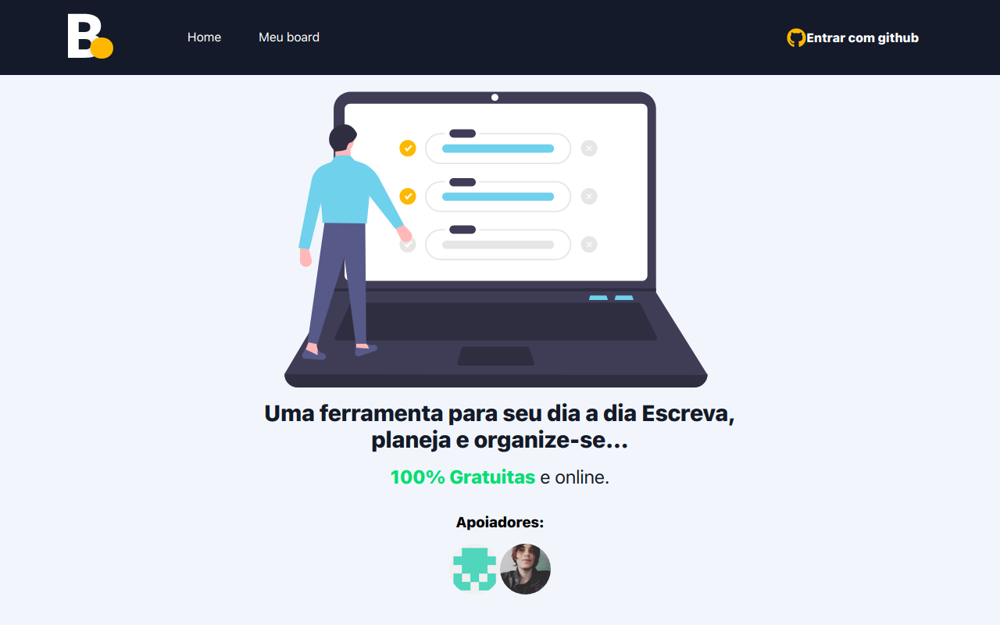

<h1 align="center">
     
</h1>

<p align="center">🎬 Meu Board, To-Do List para Programadores.</p>

<h1>
    
</h1>

<h3 align="center">
    <a href="https://board-green.vercel.app/">Acessar a demonstração</a>
</h3>

# Indice

- [Sobre](#-sobre)
- [Tecnologias Utilizadas](#-tecnologias-utilizadas)
- [Como baixar o projeto](#-como-baixar-o-projeto)

## 🔖&nbsp; Sobre

O projeto **Meu Board** é um To-Do List que foi criado dentro do curso de [NextJS](https://www.udemy.com/course/nextjs-zero-ao-avancado/) com o intuito de colocarmos em prática todo conteúdo estudado durante o curso.

---

## 🚀 Tecnologias utilizadas

O projeto foi desenvolvido utilizando as seguintes tecnologias

- [NextJS](https://nextjs.org/)
- [Firebase](https://firebase.google.com/)
---

## 🗂 Como baixar o projeto

```bash

    # Clonar o repositório
    $ git clone https://github.com/andrewqsantos/board

    # Entrar no diretório
    $ cd board

    # Instalar as dependências
    $ yarn install

    # Iniciar o projeto
    $ yarn dev
```

---

Desenvolvido 💜 por Andrew Quenehen dos Santos
